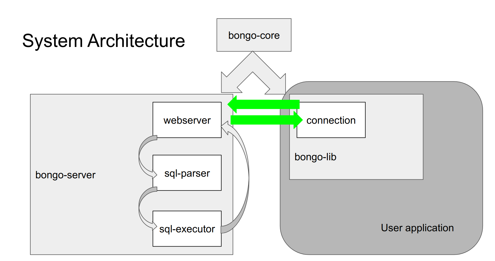

# System Architecture

## bongo-server

### Webserver

Asynchronous non-blocking multithreaded webserver built with the tokio library.

### Sql-Parser

Uses library to parse SQL into an abstract syntax tree. The main job of this component is then to to simplify the AST to only contain features that BongoDB actually supports. Although BongoDB supports a lot of features, SQL is still a very feature rich query language developed over many years and we do not support everything. Examples would be the WITH-statement or JOINs.

### Executor

The executor can execute the abstract syntax tree which is produces by the sql-parser. Look at [How BongoDB executes statements](Execution of Statements) to get a better insight into what happens on the server.

## bongo-lib

The bongo-lib is a crate that allows a program to connect to a bongo server. It consists of the main library as well as a derive macro addon.

The main library provides functions to execute SQL and query data. In addition it has a range of convenience functions that can be used without having to write any SQL, but they require certain traits to be implemented. Furthermore, it exposes the BongoError and the Row from bongo-core.

The derive addons make it easy to use the convenience functions of the main library by implementing the required traits automatically.

## bongo-core

bongo-core is a crate that defines all data structures that are needed by both the bongo-server and the bongo-lib.
